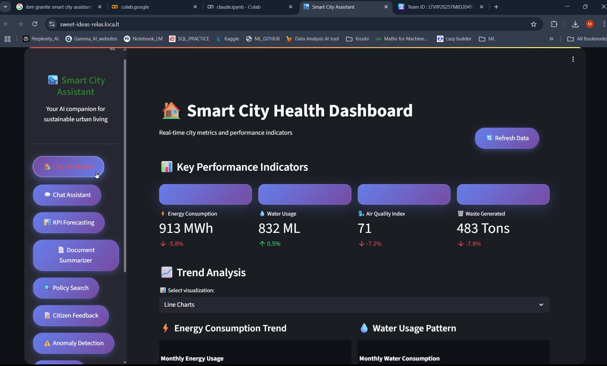
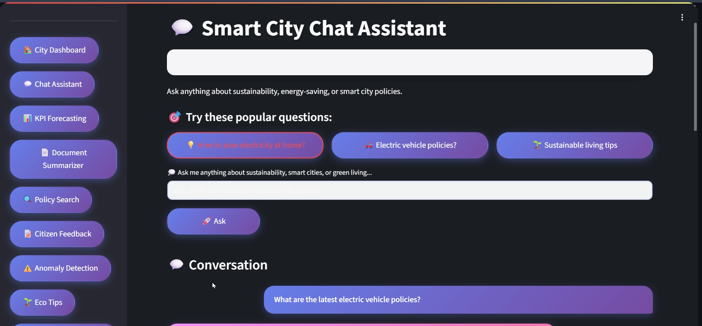
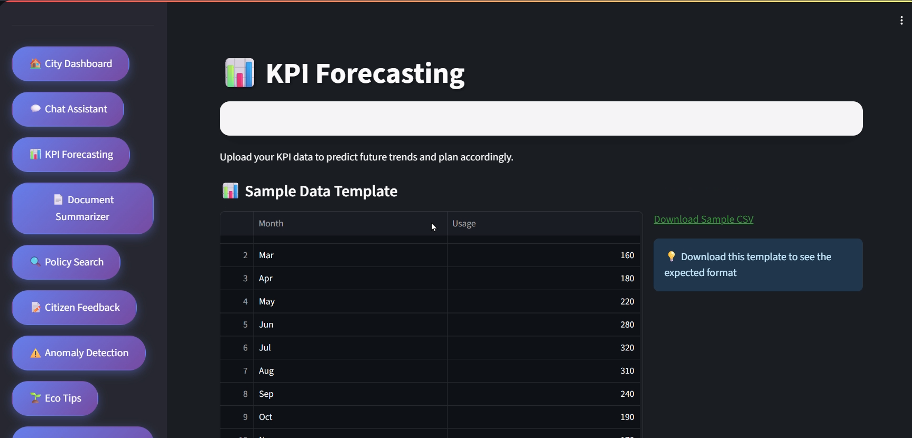
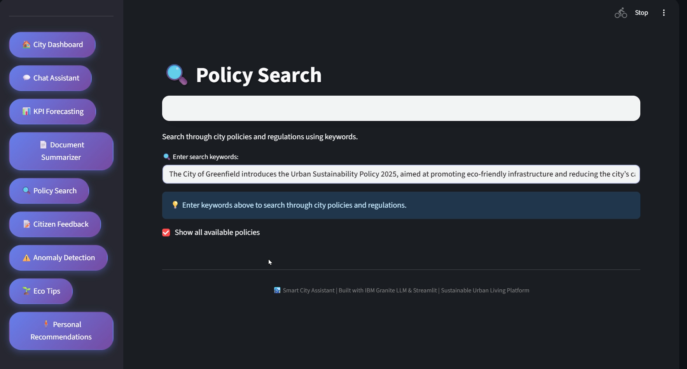
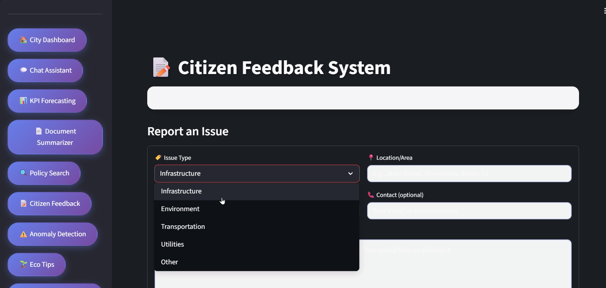
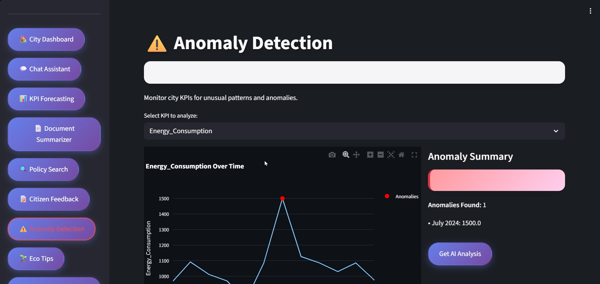
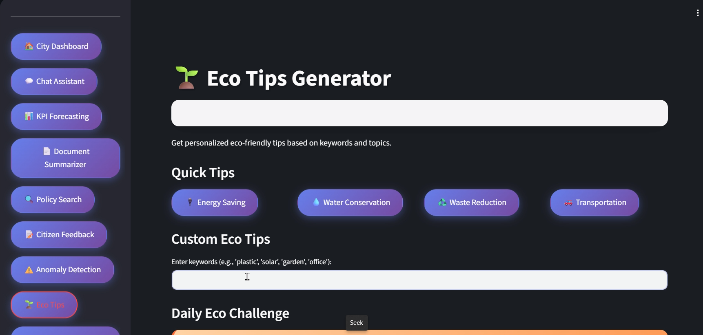
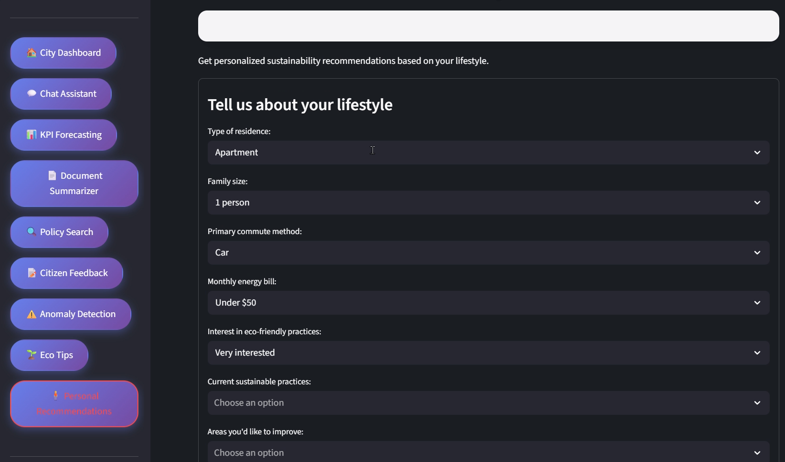

# 🌇 Sustainable Smart City Assistant

An AI-powered platform leveraging IBM Granite LLM, designed to enable sustainable urban planning, citizen feedback, and real-time city intelligence using data-driven insights.
## 📂 Project Demo Video

🎥 **Watch the demo** of the Sustainable Smart City Assistant in action:

[▶️ Click here to view on Google Drive](https://drive.google.com/file/d/1vv7T4IqNNq82-fdo8gORPga3difFio1l/view?usp=drive_link)

> _The demo walks through the dashboard, key modules like KPI Forecasting, Document Summarization, and Chat Assistant, and shows real-time interactions._

---

## 📋 Table of Contents

- [🚀 Features Overview](#-features-overview)
- [🏁 Getting Started](#-getting-started)
- [🖼️ Web Dashboard Preview](#-web-dashboard-preview)
- [📚 Feature Documentation](#-feature-documentation)
  - [📊 KPI Forecasting](#-kpi-forecasting)
  - [📄 Document Summarization](#-document-summarization)
  - [🔍 Policy Search](#-policy-search)
  - [🗣️ Citizen Feedback](#-citizen-feedback)
  - [📈 Anomaly Detection](#-anomaly-detection)
  - [🌿 Eco Tips](#-eco-tips)
  - [🤖 Chat Assistant](#-chat-assistant)
  - [🧠 Personalized Assistance](#-personalized-assistance)
- [🤝 Contributing](#contributing)

---
---

---

## 🚀 Features Overview

This assistant provides **eight intelligent modules** focused on smart governance and eco-conscious development:

| Feature                   | Description                                                | Input Types                    |
|---------------------------|------------------------------------------------------------|--------------------------------|
| 📊 KPI Forecasting        | Predict trends for city metrics using ML models           | CSV with Date and Metrics      |
| 📄 Document Summarization | Extract summaries from long government/urban reports      | PDF, TXT, DOCX                 |
| 🔍 Policy Search          | Semantic search across policy documents                   | Keyword/Natural Language       |
| 🗣️ Citizen Feedback        | Collect structured feedback from citizens                 | Forms, Text Input              |
| 📈 Anomaly Detection       | Spot irregularities in metrics or feedback trends         | Tabular data (CSV/JSON)        |
| 🌿 Eco Tips                | Recommend sustainable practices based on user interests   | Category selection             |
| 🤖 Chat Assistant          | Interactive assistant for general smart city queries      | Natural Language               |
| 🧠 Personalized Assistance | AI-generated eco-friendly plans tailored to user context  | User profile + constraints     |

---

## 🏁 Getting Started

### Prerequisites

- Google Chrome / Firefox / Safari
- Stable Internet connection
- (Optional) Verified access to city-specific data sources

### Quick Start

1. **Access the App**  
   Launch the web dashboard via: `[Insert Streamlit/FastAPI URL]`

2. **Choose Your Module**  
   From the home dashboard, pick one of the available features

3. **Interact & Analyze**  
   Upload documents, submit data, or chat with the assistant  
   AI handles analysis, planning, and visualization seamlessly

---

## 🖼️ Web Dashboard Preview

Here’s a quick visual tour of the platform:

> _All images are located in the `/web_dashboard_images/` folder. Update this section as you add more screenshots._

### 🧭 Main Dashboard

### AI assistance

### 📊 KPI Forecasting

### 🔍 Policy Search

### 🗣️ Citizen Feedback

### 📈 Anomaly Detection

### 🌿 Eco Tips Generator

### 🧠 Personalized Assistant

---

## 📚 Feature Documentation
<!-- (Same as previous section — remains unchanged) -->

...

---

## 🤝 Contributing

We welcome feedback, bug reports, and new feature ideas!

- Fork the repo  
- Create a feature branch  
- Submit a Pull Request with proper documentation

